# SIMRS Dummy

**Prototipe web Sistem Informasi Manajemen Rumah Sakit** untuk mengeksplorasi
alur pendaftaran, layanan klinis, penunjang, rawat inap, farmasi, dan kasir
di atas database MariaDB `sik`.

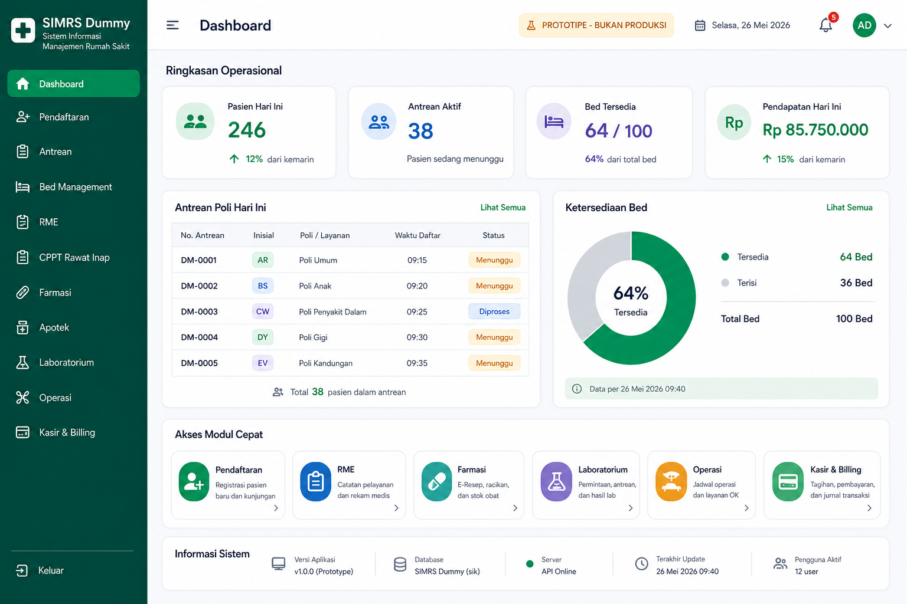

> [!CAUTION]
> **Prototipe - bukan untuk operasional rumah sakit.** Kontrol akses berbasis
> peran, audit trail, konsistensi inventori farmasi, integrasi BPJS, dan
> keamanan transaksi keuangan belum dinyatakan siap produksi.

## Jelajahi Proyek

| Tujuan | Tautan Cepat |
| --- | --- |
| Melihat pengalaman pengguna | [Galeri mockup](#galeri-mockup) |
| Memahami fungsi tiap layanan | [Modul aplikasi](#modul-aplikasi) |
| Menjalankan aplikasi | [Mulai lokal](#mulai-lokal) |
| Mengecek batasan aktual | [Status dan risiko](#status-dan-risiko) |
| Membaca dokumen teknis | [Dokumentasi](#dokumentasi) |

## Gambaran Alur

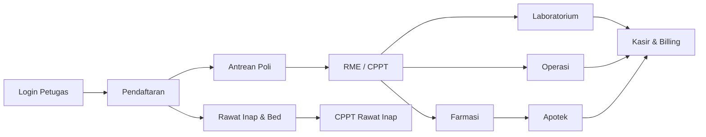

Frontend React menyediakan layar kerja petugas, sedangkan backend NestJS dan
Prisma membaca/menulis data layanan pada database SIMRS Dummy. Semua alur
yang ditampilkan di bawah adalah sasaran pengalaman pengguna prototipe.

## Galeri Mockup

Klik judul layar untuk membuka visual lebih besar.

<details open>
<summary><strong>Dashboard - ringkasan operasional</strong></summary>


Pusat navigasi petugas untuk memantau pasien harian, antrean, ketersediaan
bed, pendapatan, serta mengakses modul layanan.
</details>

<details>
<summary><strong>Login - akses petugas</strong></summary>

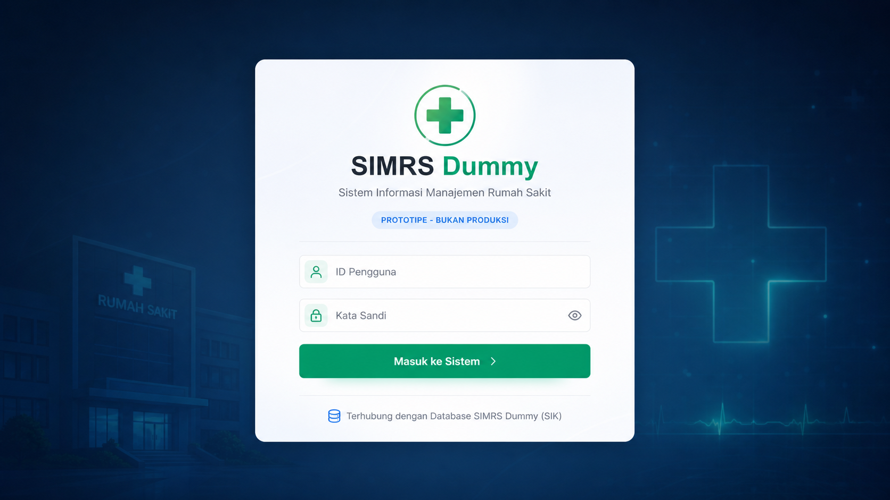

Gerbang masuk aplikasi untuk autentikasi pengguna sebelum mengakses data dan
layanan rumah sakit.
</details>

<details>
<summary><strong>Pendaftaran - registrasi kunjungan</strong></summary>

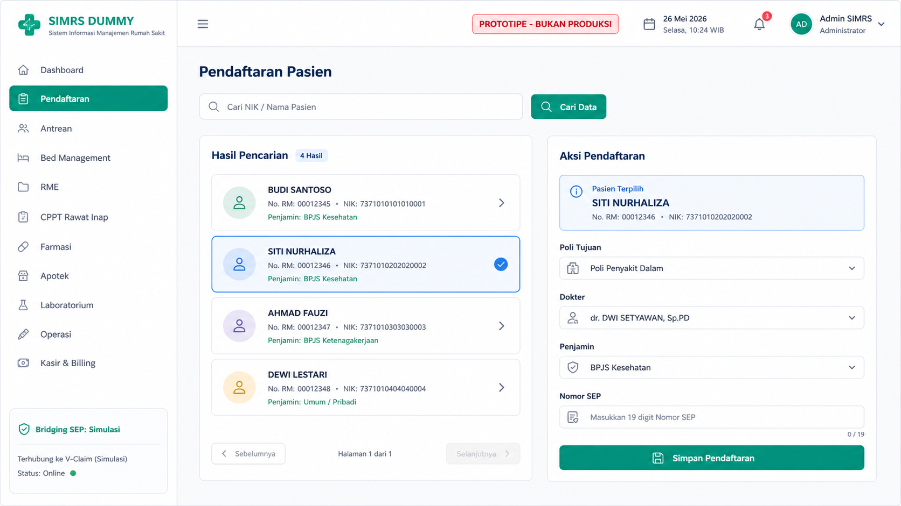

Petugas mencari pasien, memilih poli dan dokter, lalu mencatat kunjungan.
Alur SEP/BPJS masih berada pada konteks simulasi.
</details>

<details>
<summary><strong>Antrean - monitor poliklinik</strong></summary>

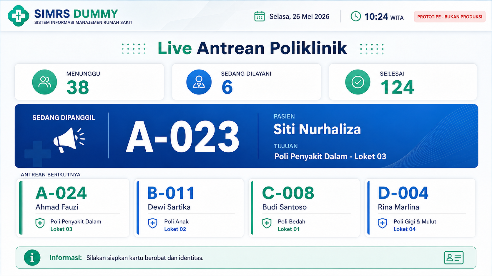

Display antrean menonjolkan pasien yang sedang dipanggil dan daftar tunggu
per poli agar alur pelayanan mudah dipantau.
</details>

<details>
<summary><strong>Bed Management - ketersediaan kamar</strong></summary>

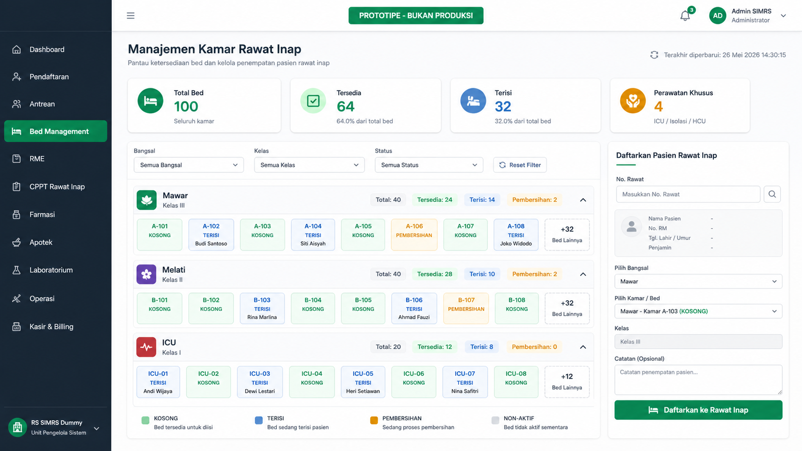

Ringkasan bed kosong dan terisi per bangsal, beserta area admisi pasien rawat
inap berdasarkan nomor rawat.
</details>

<details>
<summary><strong>RME - catatan klinis rawat jalan</strong></summary>

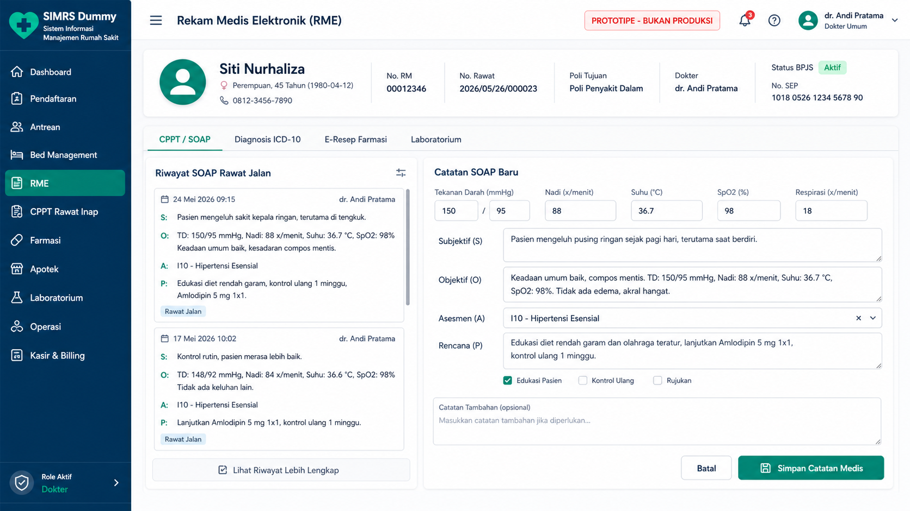

Dokter melihat riwayat SOAP, menginput catatan baru, memilih diagnosis
ICD-10, dan memulai permintaan resep atau pemeriksaan penunjang.
</details>

<details>
<summary><strong>CPPT Rawat Inap - observasi harian</strong></summary>

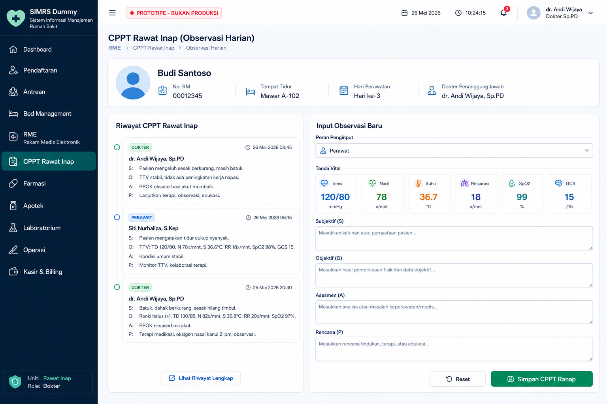

Pencatatan terintegrasi dokter dan perawat untuk observasi pasien, tanda
vital, serta perkembangan perawatan harian.
</details>

<details>
<summary><strong>Farmasi - penyusunan e-resep</strong></summary>

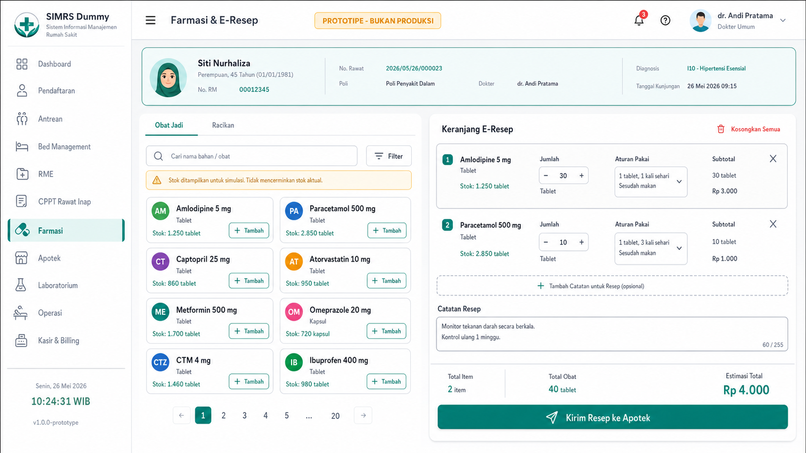

Area penyusunan obat jadi atau racikan sebelum resep diteruskan ke apotek.
Manajemen stok nyata masih memerlukan penguatan transaksi inventori.
</details>

<details>
<summary><strong>Apotek - validasi dan penyerahan obat</strong></summary>

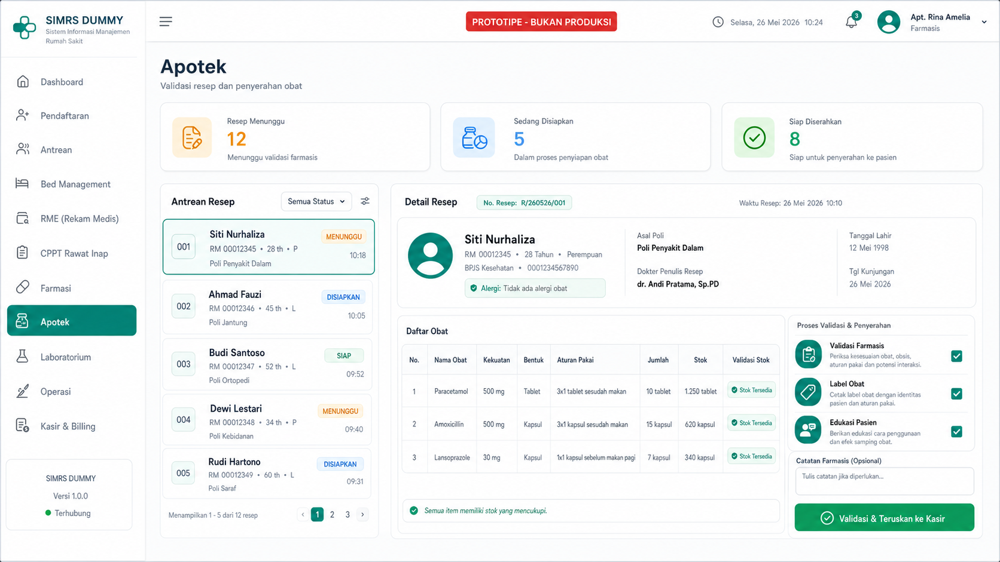

Farmasis memeriksa antrean resep, validasi item obat, dan menyiapkan
penyerahan sebelum komponen tagihan diteruskan.
</details>

<details>
<summary><strong>Laboratorium - antrean dan hasil pemeriksaan</strong></summary>

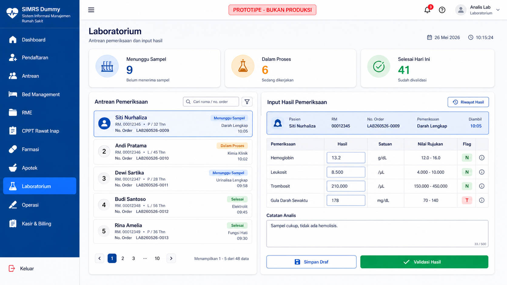

Petugas mengelola permintaan pemeriksaan, memasukkan hasil, serta melakukan
validasi data laboratorium.
</details>

<details>
<summary><strong>Operasi - pencatatan tindakan</strong></summary>

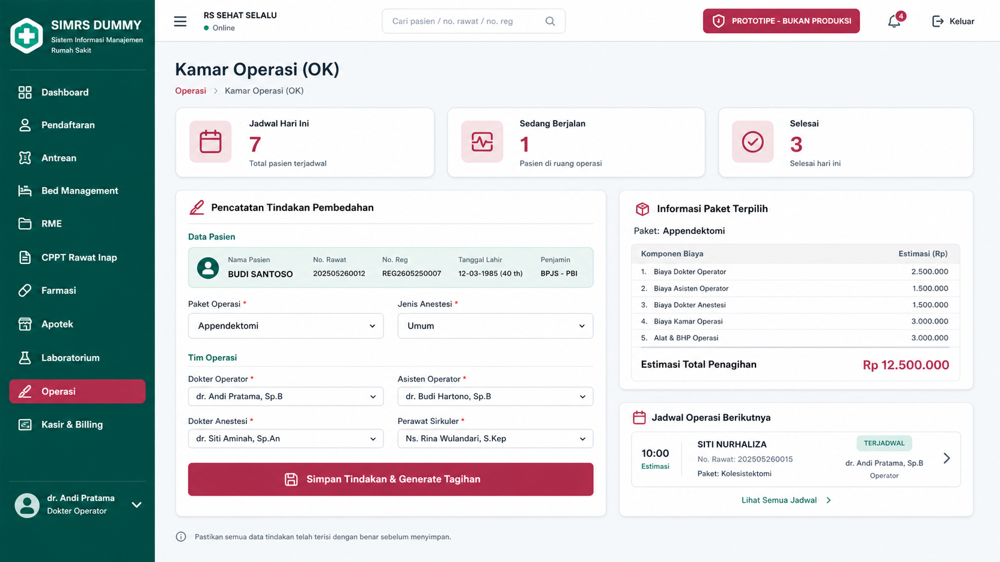

Pencatatan paket tindakan operasi, jenis anestesi, tim medis, dan estimasi
komponen penagihan pasien.
</details>

<details>
<summary><strong>Kasir - pembayaran dan billing</strong></summary>

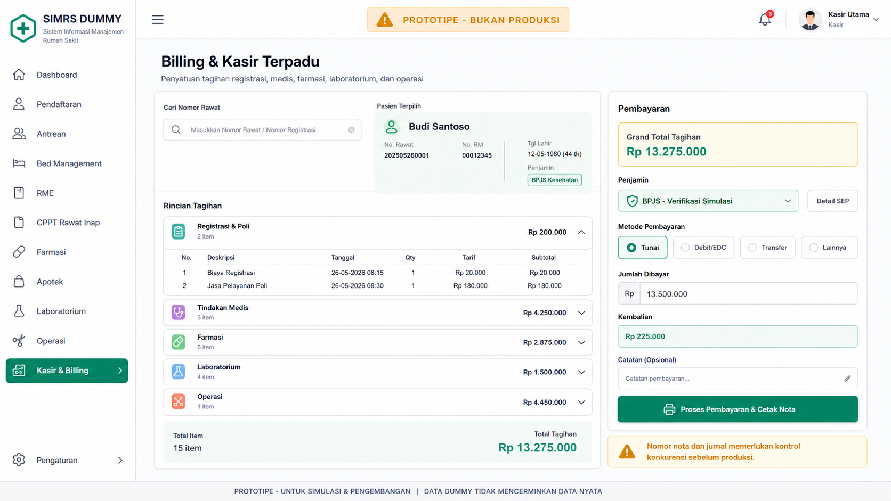

Penggabungan tagihan layanan menjadi transaksi pembayaran dan nota. Generator
nomor nota/jurnal belum aman untuk transaksi bersamaan di lingkungan produksi.
</details>

## Modul Aplikasi

| Modul | Apa yang Dikerjakan | Status Prototipe |
| --- | --- | --- |
| Autentikasi | Login admin dan pembuatan token JWT | Dasar tersedia |
| Dashboard | Akses cepat serta gambaran aktivitas pelayanan | UI tersedia |
| Pendaftaran | Cari pasien dan membuat registrasi kunjungan | Mendekati stabil, perlu audit/RBAC |
| Antrean | Menampilkan antrean pelayanan hari berjalan | Prototipe |
| Bed Management | Membaca ketersediaan kamar dan admisi | Pembacaan data mendekati stabil |
| RME / CPPT | Catatan SOAP dan diagnosis ICD-10 | Prototipe, audit trail belum aktif |
| CPPT Rawat Inap | Observasi dan catatan perkembangan pasien inap | Prototipe |
| Farmasi | Penyusunan resep obat dan racikan | Stok belum aman produksi |
| Apotek | Validasi resep serta serah obat | Stok belum aman produksi |
| Laboratorium | Permintaan, antrean, input dan hasil lab | Prototipe |
| Operasi | Paket operasi serta input pelayanan bedah | Prototipe |
| Kasir & Billing | Tagihan, pembayaran, nota dan jurnal | Risiko konkurensi tinggi |

## Teknologi

| Lapisan | Teknologi | Port Lokal |
| --- | --- | --- |
| Frontend | React 19, TypeScript, Vite, Tailwind CSS | `5173` |
| Backend | NestJS 11, Prisma, JWT | `3000` |
| Database | MariaDB, database `sik` | sesuai environment |
| Validasi domain | Python scripts dan notebook dry-run | tidak berlaku |

<details>
<summary><strong>Lihat struktur repository</strong></summary>

```text
simrs-web/
|-- docs/                  # status, risiko, testing, readiness dan mockup
|   `-- assets/mockups/     # visual referensi setiap modul
|-- simrs-backend/
|   |-- prisma/            # pemetaan model database
|   |-- src/               # modul API NestJS
|   `-- .env.example       # template konfigurasi tanpa secret
|-- simrs-frontend/
|   `-- src/               # halaman, komponen dan API client React
|-- simulation/            # validasi SQL dan skenario dry-run
`-- README.md
```
</details>

## Mulai Lokal

### Backend

```bash
cd simrs-backend
cp .env.example .env
npm install
npm run start:dev
```

Isi `.env` menggunakan konfigurasi lingkungan lokal yang benar. Jangan
commit secret atau kredensial database.

### Frontend

```bash
cd simrs-frontend
npm install
npm run dev
```

Buka `http://localhost:5173` setelah backend berjalan pada port `3000`.

<details>
<summary><strong>Konfigurasi environment penting</strong></summary>

| Variabel | Kegunaan |
| --- | --- |
| `DATABASE_URL` | Koneksi Prisma menuju MariaDB |
| `JWT_SECRET` | Kunci penandatanganan token aplikasi |
| `SIMRS_ADMIN_USERNAME_KEY` | Kunci dekripsi username admin lokal |
| `SIMRS_ADMIN_PASSWORD_KEY` | Kunci dekripsi password admin lokal |
| `DEFAULT_APOTEK_RAWAT_JALAN_KODE_BANGSAL` | Kode depo layanan apotek |
| `SIMRS_DB_*` | Koneksi untuk skrip dalam `simulation/` |
</details>

## Validasi Build

```bash
cd simrs-backend
npm run build

cd ../simrs-frontend
npm run build

cd ..
python3 -m compileall -q simulation
```

Unit test backend belum menjadi quality gate karena mock dependency
NestJS/Prisma masih perlu dibenahi.

## Status dan Risiko

Sistem ini membuktikan alur UI dan logika dasar, bukan kesiapan operasional.
Prioritas sebelum penggunaan nyata:

| Prioritas | Kebutuhan |
| --- | --- |
| Keamanan | Terapkan JWT guard menyeluruh, RBAC, dan audit trail |
| Keuangan | Amankan penomoran nota/jurnal untuk transaksi simultan |
| Farmasi | Validasi mutasi stok, riwayat barang, dan perhitungan harga |
| Klaim | Bangun integrasi atau mock SEP BPJS yang terkendali |
| Klinis | Wajibkan dan validasi ICD-10 dalam alur RME |

Lihat [CURRENT_STATE.md](docs/CURRENT_STATE.md) dan
[PRODUCTION_READINESS_CHECKLIST.md](docs/PRODUCTION_READINESS_CHECKLIST.md)
untuk status teknis yang menjadi acuan.

## Dokumentasi

| Dokumen | Isi |
| --- | --- |
| [Build Summary](docs/Build_Summary.md) | Arsitektur, modul, alur, konfigurasi dan status build |
| [Current State](docs/CURRENT_STATE.md) | Status implementasi serta batasan aktual |
| [Decision Log](docs/DECISION_LOG.md) | Keputusan teknis yang berlaku |
| [Risk Register](docs/RISK_REGISTER.md) | Risiko dan mitigasi |
| [Testing Matrix](docs/TESTING_MATRIX.md) | Skenario verifikasi |
| [Production Checklist](docs/PRODUCTION_READINESS_CHECKLIST.md) | Syarat sebelum penggunaan nyata |
| [Rollback Plan](docs/ROLLBACK_PLAN.md) | Prosedur pemulihan |
| [Security and Access Control](docs/SECURITY_AND_ACCESS_CONTROL.md) | Arah kontrol akses |
