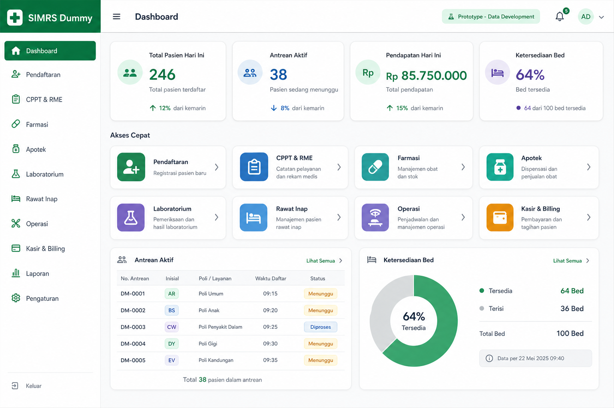

# Build Summary - SIMRS Dummy

**Tanggal ringkasan:** 26 Mei 2026  
**Status build:** Prototipe fungsional, belum siap produksi  
**Lingkup:** Frontend React, backend NestJS, pemetaan Prisma, skrip simulasi,
dan dokumentasi operasional.

## 1. Ringkasan Eksekutif

SIMRS Dummy adalah prototipe aplikasi rumah sakit berbasis web yang
menghubungkan frontend modern dengan database MariaDB `sik`. Aplikasi
mencakup alur pendaftaran pasien, antrean, bed/rawat inap, rekam medis,
farmasi dan apotek, laboratorium, operasi, kasir, serta simulasi klaim.

Aplikasi dapat dibangun secara teknis:

| Area | Hasil |
| --- | --- |
| Backend NestJS | `npm run build` berhasil |
| Frontend React/Vite | `npm run build` berhasil |
| Skrip Python | `python3 -m compileall -q simulation` berhasil |
| Unit test backend | Belum menjadi quality gate; test scaffold masih gagal karena dependency mock belum lengkap |

Walaupun build berhasil, aplikasi belum layak untuk operasional produksi
karena otorisasi masih parsial, beberapa alur memakai nilai dummy/simulasi,
validasi input belum konsisten, audit trail belum aktif, dan kontrol
transaksi perlu pengujian konkurensi.

## 2. Prinsip Integrasi Database

Proyek mengakses database `sik` yang juga menjadi sumber data sistem desktop
legacy. Prinsip utama implementasi adalah menjaga kompatibilitas data:

| Prinsip | Implikasi Implementasi |
| --- | --- |
| Database bersama | Data yang dibuat aplikasi web harus tetap dapat dibaca sistem desktop |
| Tidak mengubah tabel inti sembarangan | Model Prisma memetakan tabel yang dibutuhkan tanpa migrasi menyeluruh |
| Validasi melalui simulasi | Folder `simulation/` digunakan untuk memeriksa relasi dan transaksi dengan skenario terkontrol |
| Konfigurasi rahasia lokal | Koneksi database dan kunci autentikasi diambil dari environment, bukan disimpan dalam repository |

## 3. Arsitektur Sistem

```text
Browser
  |
  | HTTP JSON, JWT Bearer untuk request melalui apiFetch
  v
React + Vite frontend (port 5173)
  |
  | request ke http://localhost:3000
  v
NestJS backend (port 3000)
  |
  | Prisma Client dan beberapa raw SQL transaksional
  v
MariaDB / database sik
```

### 3.1 Komponen Teknologi

| Komponen | Implementasi | Peran |
| --- | --- | --- |
| Frontend | React 19, TypeScript, React Router, Tailwind CSS, Vite | Halaman operasional dan integrasi API |
| Backend | NestJS 11, TypeScript | Controller, service, autentikasi, transaksi |
| ORM | Prisma Client 5 | Pemetaan tabel dan operasi database |
| Autentikasi | Passport JWT dan `@nestjs/jwt` | Token login dan guard pada sebagian controller |
| Database | MariaDB `sik` | Penyimpanan pasien, pelayanan, billing, dan klaim simulasi |
| Validasi domain | Python scripts/notebook | Uji alur dan pemeriksaan tabel |

### 3.2 Startup Runtime

Backend dimulai dari `simrs-backend/src/main.ts`. Bootstrap:

1. Membuat aplikasi NestJS dari `AppModule`.
2. Mengaktifkan CORS.
3. Mendengarkan port dari `PORT`, dengan default `3000`.

`AppModule` mengaktifkan konfigurasi global serta mendaftarkan modul:
`Auth`, `Prisma`, `Patient`, `Registration`, `Queue`, `Bed`, `Rme`,
`Farmasi`, `Kasir`, `Bpjs`, `Casemix`, `Lab`, `Ranap`, dan `Operasi`.

### 3.3 Mockup Visual Referensi



Mockup ini merupakan referensi tampilan desktop dashboard SIMRS Dummy. Komponen visualnya mengikuti cakupan frontend saat ini: ringkasan operasional, akses cepat modul klinis dan administratif, antrean, serta status layanan menggunakan data pengembangan.

## 4. Struktur Repository

```text
simrs-web/
|-- README.md                       # halaman awal proyek
|-- docs/
|   |-- Build_Summary.md             # dokumen ini
|   |-- CURRENT_STATE.md             # status dan keterbatasan saat ini
|   |-- DECISION_LOG.md              # keputusan teknis
|   |-- PRODUCTION_READINESS_CHECKLIST.md
|   |-- RELEASE_NOTES.md
|   |-- RISK_REGISTER.md
|   |-- ROLLBACK_PLAN.md
|   `-- SECURITY_AND_ACCESS_CONTROL.md
|-- simrs-backend/
|   |-- .env.example                 # template konfigurasi lokal
|   |-- package.json                 # perintah backend dan dependency
|   |-- prisma/schema.prisma         # model database aktif
|   `-- src/                         # implementasi API NestJS
|-- simrs-frontend/
|   |-- package.json                 # perintah frontend dan dependency
|   `-- src/                         # halaman React, API helper, CSS
`-- simulation/                      # skrip dry-run dan validasi domain
```

File lokal tertentu sengaja tidak dipublikasikan, termasuk `.env`,
credential lokal, output build, dependency directory, output pembacaan
database, dan referensi skema introspeksi penuh.

## 5. Backend

### 5.1 Organisasi Modul

| Modul | Tanggung Jawab | Tabel/Domain Utama |
| --- | --- | --- |
| `auth` | Login admin, pembuatan dan validasi JWT | `admin` |
| `prisma` | Koneksi database global | seluruh model aktif |
| `patient` | Pencarian pasien dan detail berdasarkan rekam medis | `pasien` |
| `registration` | Membuat registrasi rawat jalan dan memicu SEP simulasi untuk BPJS | `reg_periksa`, `pasien` |
| `queue` | Daftar antrean kunjungan hari berjalan | `reg_periksa` |
| `bed` | Informasi tempat tidur dan admisi | `kamar`, `kamar_inap` |
| `ranap` | Daftar kamar, admisi, CPPT rawat inap | `kamar`, `kamar_inap`, `pemeriksaan_ranap` |
| `rme` | SOAP/CPPT rawat jalan dan diagnosis ICD-10 | `pemeriksaan_ralan`, `pemeriksaan_ranap`, `diagnosa_pasien`, `penyakit` |
| `farmasi` | Obat, resep, racikan, validasi, penyerahan dan stok | `databarang`, `gudangbarang`, `resep_*`, `detail_pemberian_obat` |
| `lab` | Master, permintaan, antrean dan hasil lab | `jns_perawatan_lab`, `periksa_lab`, `detail_periksa_lab` |
| `operasi` | Paket dan input pelayanan operasi | `paket_operasi`, `operasi` |
| `kasir` | Agregasi tagihan, pembayaran, nota dan jurnal | `nota_jalan`, `jurnal`, `detailjurnal` |
| `bpjs` | Pembuatan data SEP simulasi | `bridging_sep` |
| `casemix` | Pengiriman klaim INA-CBG simulasi | `bridging_sep`, `inacbg_klaim_baru` |

### 5.2 Endpoint API

Status guard berikut berdasarkan dekorator controller pada source saat
dokumen ini dibuat.

| Area | Endpoint | Fungsi | JWT Guard |
| --- | --- | --- | --- |
| Auth | `POST /api/auth/login` | Login dan menghasilkan token | Tidak, endpoint login |
| Patient | `GET /api/patients/search` | Cari pasien dengan paging | Ya |
| Patient | `GET /api/patients/:rm` | Detail pasien | Ya |
| Registration | `POST /api/registrations` | Registrasi kunjungan | Ya |
| Queue | `GET /api/queues/today` | Antrean hari ini | Ya |
| Bed | `GET /api/beds/available` | Kamar tersedia | Ya |
| Bed | `POST /api/beds/admit` | Admisi melalui modul bed | Ya |
| RME | `GET /api/rme/cppt/:rm` | Riwayat CPPT | Ya |
| RME | `POST /api/rme/soap` | Simpan SOAP rawat jalan | Ya |
| RME | `GET /api/rme/diagnoses/:rm` | Diagnosis pasien | Ya |
| RME | `POST /api/rme/diagnosis` | Simpan diagnosis | Ya |
| RME | `GET /api/rme/icd10` | Pencarian ICD-10 | Ya |
| Farmasi | `GET /farmasi/obat` | Cari master obat | Ya |
| Farmasi | `GET /farmasi/stok` | Stok per gudang | Ya |
| Farmasi | `GET /farmasi/metode-racik` | Master metode racik | Ya |
| Farmasi | `POST /farmasi/resep` | Buat resep/racikan | Ya |
| Farmasi | `GET /farmasi/antrean-resep` | Antrean apotek | Ya |
| Farmasi | `POST /farmasi/validasi` | Estimasi dan validasi stok | Ya |
| Farmasi | `POST /farmasi/serahkan` | Penyerahan dan mutasi stok | Ya |
| Kasir | `GET /kasir/tagihan/:no_rawat` | Rincian tagihan | Ya |
| Kasir | `POST /kasir/bayar` | Pembayaran dan jurnal | Ya |
| Casemix | `POST /api/casemix/klaim` | Klaim simulasi | Ya |
| Lab | `GET /lab/master`, `GET /lab/template` | Master lab | Belum terlihat |
| Lab | `POST /lab/request`, `GET /lab/antrean`, `POST /lab/hasil` | Proses lab | Belum terlihat |
| Ranap | `GET /ranap/kamar`, `POST /ranap/admisi`, `POST /ranap/cppt` | Rawat inap | Belum terlihat |
| Operasi | `GET /operasi/paket`, `POST /operasi/input` | Pelayanan operasi | Belum terlihat |

**Temuan keamanan:** JWT telah dipasang pada sejumlah modul, tetapi belum
menutupi seluruh endpoint klinis. Selain itu, pemisahan izin per peran/RBAC
belum terbukti diterapkan secara konsisten pada endpoint.

### 5.3 Autentikasi

Alur autentikasi backend:

1. `POST /api/auth/login` menerima `username` dan `password`.
2. `AuthService` membaca tabel `admin` menggunakan `AES_DECRYPT`.
3. Kunci dekripsi berasal dari `SIMRS_ADMIN_USERNAME_KEY` dan
   `SIMRS_ADMIN_PASSWORD_KEY`.
4. Jika data cocok, backend menandatangani JWT dengan `JWT_SECRET`.
5. Frontend menyimpan token pada `localStorage`; helper `apiFetch()` memasang
   header `Authorization: Bearer <token>` pada request berikutnya.
6. Jika API membalas `401`, frontend menghapus sesi lokal dan mengarahkan
   pengguna kembali ke `/login`.

## 6. Frontend

### 6.1 Routing Halaman

| Route | Halaman | Fungsi Pengguna |
| --- | --- | --- |
| `/login` | `Login.tsx` | Login aplikasi |
| `/dashboard` | `Dashboard.tsx` | Menu akses modul |
| `/registration` | `Registration.tsx` | Cari pasien dan pendaftaran |
| `/queues` | `QueueDisplay.tsx` | Monitor antrean |
| `/beds` | `BedManagement.tsx` | Lihat kamar dan admisi |
| `/rme` | `MedicalRecord.tsx` | SOAP, diagnosis, resep, request lab |
| `/farmasi` | `Farmasi.tsx` | Penyusunan resep obat/racikan |
| `/apotek` | `Apotek.tsx` | Antrean, validasi, serah obat |
| `/lab` | `Laboratorium.tsx` | Antrean dan input hasil lab |
| `/kasir` | `Kasir.tsx` | Tagihan, pembayaran dan klaim |
| `/ranap-cppt` | `RanapCPPT.tsx` | Input CPPT rawat inap |
| `/operasi` | `Operasi.tsx` | Pencatatan tindakan operasi |

### 6.2 Integrasi API Frontend

Frontend saat ini menggunakan URL backend literal
`http://localhost:3000`. Ini memadai untuk pengembangan lokal, tetapi harus
diganti menjadi konfigurasi environment untuk staging atau produksi.

`src/lib/api.ts` menyediakan:

- Penyisipan token JWT otomatis.
- Penanganan kesalahan jaringan dan response non-2xx melalui `ApiError`.
- Penghapusan sesi serta redirect login pada response `401`.

## 7. Model Data Aktif

`simrs-backend/prisma/schema.prisma` memetakan kelompok model berikut.

### 7.1 Identitas dan Pendaftaran

| Model | Fungsi |
| --- | --- |
| `pegawai`, `petugas`, `user`, `admin` | Identitas petugas, user, dan autentikasi |
| `pasien`, `penjab` | Data pasien dan penjamin |
| `poliklinik`, `dokter`, `reg_periksa` | Kunjungan dan registrasi layanan |

### 7.2 Rawat Inap dan Rekam Medis

| Model | Fungsi |
| --- | --- |
| `bangsal`, `kamar`, `kamar_inap` | Ketersediaan serta penggunaan tempat tidur |
| `pemeriksaan_ralan`, `pemeriksaan_ranap` | SOAP/CPPT rawat jalan dan inap |
| `penyakit`, `diagnosa_pasien` | Master ICD-10 dan diagnosis pasien |
| `jns_perawatan`, `rawat_jl_dr` | Jenis dan pencatatan tindakan rawat jalan |

### 7.3 Farmasi

| Model | Fungsi |
| --- | --- |
| `databarang`, `gudangbarang` | Master obat dan stok per gudang/batch |
| `resep_obat`, `resep_dokter` | Header resep dan obat jadi |
| `metode_racik`, `resep_dokter_racikan`, `resep_dokter_racikan_detail` | Peracikan obat |
| `detail_pemberian_obat`, `riwayat_barang_medis`, `set_embalase` | Penyerahan, riwayat stok, biaya tambahan |

### 7.4 Penunjang, Billing, dan Klaim

| Model | Fungsi |
| --- | --- |
| `jns_perawatan_lab`, `template_laboratorium`, `periksa_lab`, `detail_periksa_lab` | Laboratorium |
| `paket_operasi`, `operasi` | Pelayanan kamar operasi |
| `nota_jalan`, `rekening`, `jurnal`, `detailjurnal` | Kasir dan pembukuan |
| `bridging_sep`, `inacbg_klaim_baru` | SEP dan klaim simulasi |
| `simrs_web_sequence_tracker` | Model sequence yang tercatat dalam skema; keputusan terbaru menyebut pendekatan retry optimistis untuk kasir |

## 8. Alur Fungsional Utama

### 8.1 Pendaftaran Pasien

1. Pengguna mencari pasien melalui `GET /api/patients/search`.
2. Frontend mengirim data pendaftaran ke `POST /api/registrations`.
3. Service menghasilkan `no_rawat` berformat `YYYY/MM/DD/NNNNNN`.
4. Service menghasilkan nomor antrean `no_reg` berdasarkan dokter/poli.
5. Untuk penjamin BPJS (`kd_pj = BPJ`), service memanggil pembuatan SEP
   simulasi.

Catatan risiko: penomoran pendaftaran menggunakan pola baca nomor terakhir
lalu tambah satu, sehingga masih perlu pengujian race condition.

### 8.2 Rekam Medis dan Diagnosis

1. Pengguna memuat riwayat CPPT pasien melalui nomor rekam medis.
2. SOAP rawat jalan disimpan ke `pemeriksaan_ralan`.
3. Diagnosis disimpan ke `diagnosa_pasien` dan merujuk master `penyakit`.
4. Rawat inap memiliki jalur CPPT tersendiri melalui modul `ranap`.

Catatan risiko: audit perubahan catatan medis belum tampak tersedia.

### 8.3 Farmasi dan Penyerahan Obat

1. Dokter/pengguna mencari obat, mengecek stok, dan membuat resep.
2. Resep mendukung obat jadi serta racikan dengan detail komponen.
3. Apotek mengambil antrean resep yang belum diserahkan.
4. Validasi resep menghitung estimasi harga serta memeriksa kecukupan stok.
5. Penyerahan membutuhkan `kd_bangsal_asal`.
6. Dalam transaksi database, sistem mengunci baris stok dengan
   `SELECT ... FOR UPDATE`, memotong stok, mencatat
   `riwayat_barang_medis`, membuat `detail_pemberian_obat`, lalu menandai
   resep telah diserahkan.

Catatan risiko: biaya `embalase` dan `tuslah` saat ini masih berupa nilai
tetap dalam service, dan petugas riwayat stok masih dicatat sebagai `System`.

### 8.4 Laboratorium dan Operasi

Laboratorium mendukung pemilihan layanan, permintaan pemeriksaan, antrean,
dan penyimpanan detail hasil. Biaya dibentuk saat header pemeriksaan dibuat.

Operasi memuat master paket, menerima input pelaksanaan, lalu menyalin
komponen tarif paket ke record `operasi` untuk masuk agregasi billing.

Catatan risiko: controller laboratorium dan operasi belum terlihat memakai
JWT guard.

### 8.5 Kasir dan Jurnal

1. Kasir mengambil tagihan berdasarkan `no_rawat`.
2. Tagihan mengagregasi registrasi, tindakan dokter, obat, laboratorium,
   kamar inap, dan operasi.
3. Pembayaran menolak nominal yang kurang dan melakukan validasi total debit
   dan kredit.
4. Service membuat nomor nota dan jurnal berdasarkan tanggal.
5. Penyimpanan nota, status bayar, status tindakan, jurnal, serta
   detail jurnal dilakukan dalam transaksi.
6. Jika terjadi unique constraint collision (`P2002`), service mencoba ulang
   hingga lima kali.

Catatan risiko: pendekatan retry optimistis perlu dibuktikan dengan uji
transaksi paralel; piutang, refund, dan pembatalan belum tercakup.

### 8.6 SEP dan Casemix

Modul `bpjs` dan `casemix` membangun payload serta menyimpan hasil simulasi
ke tabel lokal. Keduanya bukan integrasi production dengan layanan eksternal.
Casemix mensyaratkan SEP dan diagnosis pasien sebelum klaim simulasi dibuat.

## 9. Konfigurasi Lingkungan

Template tersedia pada `simrs-backend/.env.example`.

| Variabel | Dipakai Oleh | Fungsi |
| --- | --- | --- |
| `DATABASE_URL` | Prisma backend | Koneksi MariaDB |
| `JWT_SECRET` | Auth/JWT strategy | Menandatangani dan memvalidasi token |
| `SIMRS_ADMIN_USERNAME_KEY` | Auth service | Konfigurasi dekripsi username |
| `SIMRS_ADMIN_PASSWORD_KEY` | Auth service | Konfigurasi dekripsi password |
| `DEFAULT_APOTEK_RAWAT_JALAN_KODE_BANGSAL` | Farmasi validasi | Depo default saat estimasi resep |
| `SIMRS_DB_HOST`, `SIMRS_DB_USER`, `SIMRS_DB_PASSWORD`, `SIMRS_DB_NAME` | Skrip simulasi | Koneksi validasi Python |
| `SIMRS_SCHEMA_DUMP_PATH` | `simulation/dump_schema.py` | Lokasi output dump skema lokal |

Aturan publikasi:

- Jangan commit `.env`.
- Jangan commit credential atau token.
- Jangan commit hasil pembacaan data nyata.
- Gunakan placeholder pada template konfigurasi.

## 10. Menjalankan dan Membangun

### 10.1 Backend

```bash
cd simrs-backend
cp .env.example .env
npm install
npm run build
npm run start:dev
```

### 10.2 Frontend

```bash
cd simrs-frontend
npm install
npm run build
npm run dev
```

Frontend pengembangan dapat dibuka pada `http://localhost:5173`, sedangkan
backend menggunakan `http://localhost:3000` secara default.

### 10.3 Simulasi

```bash
export SIMRS_DB_HOST=localhost
export SIMRS_DB_USER=...
export SIMRS_DB_PASSWORD=...
export SIMRS_DB_NAME=sik
python3 -m compileall -q simulation
```

Skrip yang menulis data harus dijalankan hanya pada database pengembangan
atau dengan rollback yang telah ditinjau.

## 11. Status Verifikasi dan Quality Gate

| Verifikasi | Status Saat Penyusunan | Catatan |
| --- | --- | --- |
| Backend compile/build | Lulus | NestJS menghasilkan output build |
| Frontend compile/build | Lulus | Vite menghasilkan bundle produksi |
| Sintaks skrip Python | Lulus | Seluruh script dapat dikompilasi |
| Unit test backend | Belum lulus | Test scaffold belum menyediakan mock dependency yang diperlukan |
| Uji konkurensi kasir | Belum tervalidasi | Wajib sebelum produksi |
| Uji mutasi stok farmasi | Belum dinyatakan lulus | Wajib melibatkan skenario stok/batch/depo |
| Uji RBAC menyeluruh | Belum lulus | Guard belum mencakup seluruh endpoint |

## 12. Temuan Implementasi yang Perlu Ditindaklanjuti

| Prioritas | Temuan | Dampak | Aksi Teknis |
| --- | --- | --- | --- |
| Kritis | Proteksi JWT belum mencakup `lab`, `ranap`, dan `operasi` | Endpoint klinis dapat tidak terlindungi | Terapkan guard dan pengujian akses |
| Kritis | RBAC per peran belum konsisten | Token valid dapat mengakses fungsi yang tidak semestinya | Implementasikan permission guard |
| Tinggi | Pembayaran mengandalkan retry nomor nota/jurnal | Risiko benturan pada beban paralel | Jalankan test konkurensi dan kuatkan transaksi |
| Tinggi | Pendaftaran/resep memakai baca-terakhir tambah-satu | Risiko nomor ganda | Terapkan strategi collision handling |
| Tinggi | SEP/Casemix adalah simulasi | Tidak dapat dipakai untuk klaim riil | Pisahkan mode simulasi dan adaptor resmi |
| Tinggi | Tidak ada audit trail operasional yang terbukti aktif | Perubahan klinis/keuangan sulit dilacak | Implementasikan pencatatan audit |
| Sedang | URL API frontend literal localhost | Tidak siap deployment environment lain | Gunakan variable konfigurasi Vite |
| Sedang | Beberapa request memakai `any` | Validasi payload lemah | Tambahkan DTO dan validation pipe |
| Sedang | Tarif farmasi tambahan menggunakan angka tetap | Billing dapat tidak sesuai kebijakan | Hubungkan master tarif/config yang disahkan |

## 13. Dokumen Referensi Aktif

| File | Kegunaan |
| --- | --- |
| `README.md` | Orientasi dan langkah awal pengembangan |
| `docs/CURRENT_STATE.md` | Pernyataan status terkini dan keterbatasan |
| `docs/DECISION_LOG.md` | Riwayat keputusan arsitektur dan operasional |
| `docs/RISK_REGISTER.md` | Daftar risiko kritis |
| `docs/TESTING_MATRIX.md` | Skenario uji yang harus dipenuhi |
| `docs/PRODUCTION_READINESS_CHECKLIST.md` | Kriteria penggunaan nyata |
| `docs/ROLLBACK_PLAN.md` | Tindakan pemulihan saat insiden |
| `docs/SECURITY_AND_ACCESS_CONTROL.md` | Arah desain kontrol akses |

## 14. Kesimpulan Build

SIMRS Dummy telah memiliki cakupan modul prototipe yang luas dan source dapat
dibangun untuk frontend maupun backend. Fokus berikutnya bukan menambah menu,
melainkan membuktikan keselamatan transaksi dan akses: proteksi seluruh API,
RBAC, audit trail, validasi DTO, uji konkurensi kasir, uji mutasi inventori,
serta pemisahan yang tegas antara integrasi simulasi dan integrasi produksi.
